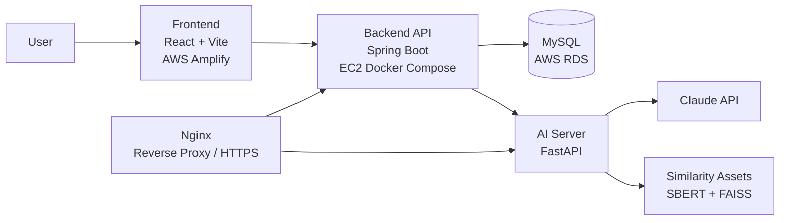

# Sidepick

> **AI 기반 부업 실패 분석 플랫폼**  
> 실패 경험을 기록하고, AI가 유사 사례와 다음 액션을 분석해주는 서비스입니다.

<p align="left">
  
  
  
  
  
  
</p>

**Live**
- Service: [side-pick.app](https://side-pick.app)
- API: [api.side-pick.app/api](https://api.side-pick.app/api)

---

## Why Sidepick

부업 시장에는 성공 후기보다 실패 경험이 훨씬 적게 공유됩니다.  
Sidepick은 그 빈 공간을 채우기 위해 만들어졌습니다.

- 실패 경험을 구조화해 남길 수 있습니다.
- 유사한 사례를 다시 찾아볼 수 있습니다.
- AI가 실패 원인과 개선 방향을 요약해줍니다.
- 감정적인 후기보다, 다음 선택에 도움이 되는 데이터로 바꿉니다.

---

## Core Features

| 기능 | 왜 필요한가 | 사용자 가치 | 기술 포인트 |
| --- | --- | --- | --- |
| **실패 경험 등록** | 흩어진 실패담을 구조화된 데이터로 남기기 위해 | 내 경험을 다시 꺼내보고, 분석 가능한 입력으로 전환 | React 폼, JWT 인증, Spring Validation |
| **AI 분석 리포트** | 단순 기록에서 끝나지 않도록 | 실패 원인, 유사 사례, 가이드까지 한 화면에서 확인 | Spring → FastAPI 분석 요청, Claude 기반 요약 |
| **유사 사례 탐색** | “나만 실패한 게 아닌가?”를 해소하기 위해 | 비슷한 사례를 비교하며 판단 기준 확보 | 카테고리/키워드 기반 탐색, SBERT + FAISS 자산 활용 |
| **카테고리형 FAQ / 가이드** | 초보 사용자의 진입 장벽을 낮추기 위해 | 부업 시작 전 필요한 맥락을 빠르게 이해 | Figma 기반 UI, 카테고리 필터, 검색 UX |
| **소셜 로그인 / 사용자 흐름** | MVP 진입 장벽을 낮추기 위해 | 빠르게 로그인하고 기록·조회 흐름 유지 | Kakao / Google OAuth, 세션 저장, 접근 제어 |

<details>
<summary><strong>대표 사용자 흐름 보기</strong></summary>

1. 사용자가 실패 경험을 등록합니다.
2. 백엔드가 경험 데이터를 저장하고 AI 서버에 분석을 요청합니다.
3. AI 서버가 분석 결과를 생성합니다.
4. 사용자는 사례 상세에서 분석 리포트와 유사 사례를 확인합니다.
5. 탐색 / FAQ / 카테고리 화면으로 이어지는 학습 루프를 만듭니다.

</details>

---

## System Architecture

### 한눈에 보는 구조

- **Frontend**: 사용자 경험과 탐색 흐름 제공
- **Backend**: 인증, 경험, 분석, 카테고리 API 제공
- **AI Server**: 분석 생성과 AI 응답 처리
- **Database**: 경험 / 분석 / 사용자 데이터 저장
- **Infra**: 운영 배포, 프록시, HTTPS 종료, 컨테이너 실행



### 요청 흐름

1. 사용자는 Amplify에 배포된 프론트엔드에 접속합니다.
2. 프론트는 백엔드 API로 경험 등록 / 조회 / 인증 요청을 보냅니다.
3. 백엔드는 MySQL(RDS)에 서비스 데이터를 저장합니다.
4. 분석이 필요한 경우 백엔드는 별도 FastAPI 서버로 요청을 전달합니다.
5. AI 서버는 Claude API와 추천 자산을 사용해 분석 결과를 생성합니다.
6. 생성된 결과는 다시 백엔드와 프론트로 연결됩니다.

---

## Tech Stack

| 영역 | 기술 | 사용 이유 |
| --- | --- | --- |
| Frontend | React 19, TypeScript, Vite | 빠른 개발 속도와 명확한 타입 안정성 |
| Styling | Tailwind CSS 4 | 화면 단위 실험과 Figma 반영 속도 확보 |
| Routing | React Router | 탐색 / 상세 / 인증 흐름 분리 |
| Backend | Spring Boot 3.2, Java 17 | 안정적인 REST API와 검증 / 인증 / JPA 구조 |
| Database | MySQL, Spring Data JPA | 관계형 데이터 관리와 운영 친화성 |
| Migration | Flyway | 운영 DB 스키마 변경 이력 관리 |
| Auth | JWT, Kakao OAuth, Google OAuth | MVP 접근성 + 보호된 사용자 흐름 구현 |
| AI Server | FastAPI, Python | 백엔드와 분리된 AI 실행 경계 확보 |
| LLM | Anthropic Claude API | 긴 문맥 분석과 가이드 생성 품질 확보 |
| Similarity | SBERT + FAISS 자산 | 유사 사례 탐색을 위한 임베딩 기반 검색 준비 |
| Infra | Docker Compose, Nginx | 로컬/운영 실행 방식 일관성 유지 |
| Cloud | AWS Amplify, EC2, RDS | 프론트/백엔드/DB 역할 분리와 운영 단순화 |

---

## Monorepo Structure

```txt
Sidepick/
├─ fe/          # React frontend
├─ server/      # Spring Boot API server
├─ ai/          # FastAPI AI server, data pipeline, recommender assets
├─ infra/       # Docker Compose, Nginx, MySQL init
├─ docs/        # architecture, API, deployment, schema docs
├─ scripts/     # utility scripts
├─ .env.example # local environment template
└─ README.md
```

### Folder Roles

- `fe/`
  프론트엔드 UI, 탐색/FAQ/사례 상세/인증 화면을 담당합니다.

- `server/`
  인증, 경험 등록/조회, 분석 연동, 카테고리 API를 제공합니다.

- `ai/`
  FastAPI 분석 서버와 데이터 파이프라인, 추천 자산을 관리합니다.

- `infra/`
  로컬 개발용 Compose와 운영용 Nginx/Compose 설정을 포함합니다.

- `docs/`
  API 계약, 아키텍처, 배포, DB 스키마 문서를 정리합니다.

---

## Key Engineering Decisions

### 1. AI 서버를 백엔드와 분리

**문제**  
웹 API와 LLM 호출을 한 프로세스에 섞으면 운영 경계가 흐려집니다.

**해결**  
Spring Boot와 FastAPI를 분리해 API 서버와 AI 실행 레이어를 나눴습니다.

**효과**
- 백엔드 도메인 로직과 AI 로직의 책임 분리가 명확합니다.
- AI 모델/프롬프트 변경이 메인 API 서버 안정성에 덜 영향을 줍니다.
- 운영 중 장애 원인 추적이 쉬워집니다.

### 2. Docker Compose 기반 로컬/운영 정렬

**문제**  
개발 환경과 운영 환경이 다르면 배포 시점에 예기치 않은 차이가 생깁니다.

**해결**  
로컬은 `infra/docker-compose.yml`, 운영은 `infra/docker-compose.prod.yml`을 기준으로 맞췄습니다.

**효과**
- 서비스 간 포트/환경 변수 구조를 일관되게 유지할 수 있습니다.
- 운영 서버 구조를 문서화하고 재현하기 쉬워집니다.

### 3. Nginx Reverse Proxy로 외부 진입점 단순화

**문제**  
백엔드와 AI 서버를 외부에 직접 노출하면 보안/라우팅 관리가 복잡해집니다.

**해결**  
운영 환경에서는 Nginx 컨테이너가 HTTPS와 외부 진입점을 맡습니다.

**효과**
- 외부 공개 포인트를 단순화할 수 있습니다.
- 백엔드와 AI 서버는 내부 네트워크 기준으로 관리할 수 있습니다.

### 4. 실패 경험을 “탐색 가능한 데이터”로 설계

**문제**  
실패담은 대부분 게시글 단위로 흩어져 있어 재사용이 어렵습니다.

**해결**  
카테고리, 실패 원인, 어려움, 분석 결과를 구조화된 데이터로 저장합니다.

**효과**
- FAQ, 유사 사례, 탐색 경험으로 재활용 가능합니다.
- 단순 커뮤니티 글보다 제품형 데이터 자산에 가까워집니다.

### 5. 운영 데이터와 데모 데이터 분리

**문제**  
MVP 단계에서 데모 데이터가 운영 데이터와 섞이면 신뢰도가 떨어집니다.

**해결**  
운영에서는 `APP_DEMO_SEED_ENABLED=false`를 기준으로 분리하고, CSV import도 별도 작업으로 관리합니다.

**효과**
- 운영 데이터 기준이 명확합니다.
- 시연용 시드와 실제 서비스 데이터를 분리할 수 있습니다.

---

## Quick Start

### 1. Prerequisites

- Node.js 20+
- Java 17
- Docker / Docker Compose
- Python 3.11+ 권장

### 2. Environment Variables

루트에 `.env` 파일을 만들고 `.env.example`을 기반으로 채웁니다.

```bash
cp .env.example .env
```

### 3. Frontend

```bash
cd fe
npm install
npm run dev
```

- Default: [http://localhost:5173](http://localhost:5173)

### 4. Backend + AI + MySQL via Docker

```bash
cd infra
docker compose up -d --build
```

- Backend: [http://localhost:8081](http://localhost:8081)
- AI Server: [http://localhost:8001](http://localhost:8001)
- Nginx: [http://localhost](http://localhost)

### 5. Production-like compose

운영 구조 확인이 필요하면:

```bash
cd infra
docker compose --env-file ../.env -f docker-compose.prod.yml up -d --build
```

---

## Environment Variables

민감 정보는 저장소에 포함하지 않습니다. 아래는 대표 변수만 정리한 예시입니다.

| 변수 | 설명 | 예시 |
| --- | --- | --- |
| `SPRING_PROFILES_ACTIVE` | 실행 프로필 | `local`, `docker`, `prod` |
| `SERVER_PORT` | 백엔드 포트 | `8081` |
| `AI_SERVER_PORT` | AI 서버 포트 | `8001` |
| `SPRING_DATASOURCE_URL` | MySQL 연결 URL | `jdbc:mysql://...` |
| `SPRING_DATASOURCE_USERNAME` | DB 계정 | `failforward` |
| `SPRING_DATASOURCE_PASSWORD` | DB 비밀번호 | `***` |
| `APP_JWT_SECRET` | JWT 서명 키 | `***` |
| `AI_SERVER_URL` | 백엔드가 호출하는 AI 서버 주소 | `http://ai-server:8001` |
| `ANTHROPIC_API_KEY` | Claude API 키 | `***` |
| `APP_CORS_ALLOWED_ORIGINS` | 허용 프론트 도메인 | `https://side-pick.app,...` |
| `APP_AUTH_KAKAO_ENABLED` | 카카오 로그인 활성화 | `true/false` |
| `APP_AUTH_GOOGLE_ENABLED` | 구글 로그인 활성화 | `true/false` |
| `APP_DEMO_SEED_ENABLED` | 데모 시드 주입 여부 | `false` |

전체 예시는 [.env.example](./.env.example)를 참고하세요.

---

## API & Documentation

### Project Docs

- [Docs Index](./docs/README.md)
- [Project Overview](./docs/00_project_overview.md)
- [Current Architecture](./docs/01_current_architecture.md)
- [API Contract](./docs/02_api_contract.md)
- [Frontend Structure](./docs/03_frontend_structure.md)
- [Backend Structure](./docs/04_backend_structure.md)
- [AI Integration Contract](./docs/05_ai_integration_contract.md)
- [Deployment Guide](./docs/07_deployment.md)
- [DB Schema](./docs/db-schema.md)

### Service-specific Docs

- [Backend README](./server/README.md)
- [AI README](./ai/README.md)
- [Frontend README](./fe/README-FE.md)

---

## Screenshots / Demo Assets

README를 포트폴리오용으로 더 강화하려면 아래 자산을 추가하는 구성이 좋습니다.

| 위치 | 추천 자산 | 권장 경로 |
| --- | --- | --- |
| Hero 바로 아래 | 서비스 대표 화면 1장 | `docs/assets/readme/hero-home.png` |
| 핵심 기능 섹션 아래 | 등록 → 분석 → 유사 사례 흐름 GIF | `docs/assets/readme/flow-demo.gif` |
| 아키텍처 섹션 아래 | 실제 인프라 다이어그램 이미지 | `docs/assets/readme/architecture.png` |
| FAQ / 탐색 섹션 | 모바일 UI 캡처 2~3장 | `docs/assets/readme/faq.png`, `explore.png` |

> 현재 README는 이미지가 없어도 읽히도록 설계했습니다.  
> 자산이 준비되면 위 경로 기준으로 바로 확장할 수 있습니다.

---

## Development Notes / Troubleshooting

### 왜 실패 경험 중심인가

성공 사례는 이미 많지만, 사용자가 실제로 막히는 지점은 실패 과정에 더 잘 드러납니다.  
이 프로젝트는 실패 기록을 단순 아카이브가 아니라, 다음 판단을 돕는 제품 데이터로 바꾸는 데 초점을 맞췄습니다.

### 왜 운영 문서 기준을 다시 정리했는가

프로젝트가 커지면서 로컬 구조, 운영 구조, 과거 문서가 서로 달라졌습니다.  
README와 배포 문서는 현재 운영 기준 경로와 Compose 기준으로 재정렬했습니다.

### 왜 README를 기능 나열형으로 두지 않았는가

포트폴리오 README는 “무엇을 만들었는가”보다 “왜 이렇게 설계했는가”가 더 중요합니다.  
그래서 기능보다 아키텍처, 데이터 흐름, 설계 의도, 운영 구조를 앞에 배치했습니다.

### 현재 개선 여지

- README용 스크린샷 / GIF 자산 정리
- 문서 디렉토리의 일부 깨진 한글 문구 정리
- AI 추천 파이프라인과 운영 분석 서버 문서 통합

---

## Repository Quality Notes

- 사용자에게 노출되는 한글 문구는 깨진 상태로 두지 않습니다.
- 운영 기준 문서는 `docs/`, `server/README.md`, `infra/` 설정을 우선합니다.
- `archive/` 문서는 과거 참고용이며 현재 운영 기준과 다를 수 있습니다.

---

## Recommended README Add-ons

추가하면 더 좋아지는 요소:

- 실제 서비스 스크린샷 3장
- 사례 등록 → AI 분석 → 유사 사례 탐색 GIF
- 운영 아키텍처 이미지
- “Before / After” 문제 해결 예시 1개
- API 예시 응답 스니펫 1개

---

## License

별도 라이선스 정책이 정리되기 전까지는 내부/포트폴리오 용도로 관리합니다.
