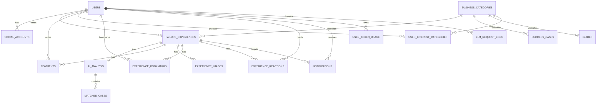

# BE-01 DB 스키마 ERD

## 전달 산출물

- DB 스키마 ERD
- 마이그레이션 스크립트 초안: [BE-01 마이그레이션 스크립트 초안.sql](./BE-01%20마이그레이션%20스크립트%20초안.sql)

## 최종 결정 요약

1. 회원가입 상세항목은 `users` 확장으로 처리한다.
2. `nickname`은 기존 컬럼을 유지하고 신규 컬럼으로 다시 만들지 않는다.
3. 관심분야, 북마크, 반응은 각각 별도 조인 테이블로 분리한다.
4. 경험 사진은 `experience_images` 테이블로 분리하고 이미지 URL 중심으로 저장한다.
5. 성공사례는 실패사례와 최대한 유사한 별도 `success_cases` 테이블로 둔다.
6. 부업 가이드는 별도 `guides` 테이블로 분리한다.
7. 운영 추적은 `user_token_usage`와 `llm_request_logs`로 분리한다.

## 팀장 확인 필요 항목

1. `users` 확장, `experience_reactions`, `success_cases`, `notifications`, `guides`, 토큰 모니터링 2종 테이블 포함 방향 모두 팀장 확인 완료

## 목적

고도화 1주차 기준으로 확정해야 하는 신규 데이터 구조를 정리한다.

현재 운영 중인 MVP 스키마를 유지하면서 아래 기능을 수용하는 방향으로 설계한다.

- 회원가입 상세항목 7개
- 마이페이지
- 관심분야
- 북마크
- 공감/좋아요
- 댓글 알림
- 경험 사진 첨부
- 프로필 사진
- 성공사례
- 부업 가이드
- 토큰 사용량 추적

## 현재 상태 요약

현재 코드 기준으로 이미 존재하는 핵심 테이블은 아래와 같다.

- `users`
- `social_accounts`
- `email_verification_tokens`
- `business_categories`
- `failure_experiences`
- `ai_analysis`
- `matched_cases`
- `comments`

현재 없는 것 중 이번 고도화에 필요한 핵심 영역은 아래다.

- 회원 상세 프로필 컬럼
- 관심분야
- 북마크
- 반응/공감
- 알림
- 경험 이미지
- 성공사례
- 부업 가이드
- 토큰 사용량 추적

## 현재 대비 변경 요약

### A. `users`에서 이미 있는 항목

- `nickname`
- `profile_image`
- `auth_provider`

### B. `users`에 새로 확정할 항목

- `full_name`
- `birth_date`
- `gender`
- `region`
- `signup_purpose`
- `side_hustle_experience_status`

메모:

- 요청서의 회원가입 상세항목 7개 중 `닉네임`은 이미 현재 스키마에 존재한다.
- 따라서 DB 변경 기준으로는 `nickname` 신규 추가가 아니라, 기존 컬럼 유지 + 나머지 프로필 컬럼 추가로 정리한다.

### C. 이번 주 신규 테이블 확정 대상

- `user_interest_categories`
- `experience_images`
- `experience_bookmarks`
- `experience_reactions`
- `notifications`
- `success_cases`
- `guides`
- `user_token_usage`
- `llm_request_logs`

## 설계 원칙

1. 기존 `users`, `failure_experiences`, `comments`는 최대한 보존한다.
2. 고도화 기능은 신규 조인 테이블과 보조 테이블로 확장한다.
3. 성공사례는 실패사례와 최대한 유사한 스키마를 맞춘다.
4. 현재 이미지 저장은 URL 기준으로 설계하고, 저장소 구현은 특정 벤더에 묶지 않는다.
5. 부업 가이드는 검색/카테고리/사례 연결이 쉬운 단일 테이블로 시작한다.
6. 토큰/비용 모니터링은 집계 테이블과 요청 로그 테이블을 분리한다.

## 제안 스키마

### 1. `users` 확장

추가 컬럼:

- `full_name` `varchar(50)` null
- `birth_date` `date` null
- `gender` `varchar(20)` null
- `region` `varchar(50)` null
- `signup_purpose` `varchar(30)` null
- `side_hustle_experience_status` `varchar(20)` null

유지 컬럼:

- `nickname`
- `age_group`
- `profile_image`
- `auth_provider`

메모:

- `nickname`은 공개용 표시명으로 유지
- `profile_image`는 CDN/공개 URL
- `experience_status`는 `NONE`, `PLANNING`, `FAILED_BEFORE`, `OPERATING` 정도의 enum을 권장
- `age_group`은 기존 MVP 호환용으로 당장은 유지하되, 장기적으로는 `birth_date` 기반 계산 가능

### 2. `user_interest_categories`

관심 부업 다중 선택을 위한 조인 테이블.

컬럼:

- `id` bigint pk
- `user_id` bigint fk -> `users.id`
- `category_id` bigint fk -> `business_categories.id`
- `created_at` timestamp

제약:

- `unique(user_id, category_id)`

### 3. `experience_images`

경험 등록 시 사진 첨부용.

컬럼:

- `id` bigint pk
- `experience_id` bigint fk -> `failure_experiences.id`
- `image_url` varchar(500) not null
- `thumbnail_url` varchar(500) null
- `sort_order` int not null default 0
- `created_at` timestamp
- `updated_at` timestamp

메모:

- MVP 기준 1~3장 허용을 권장
- 현재 설계는 저장소 종류와 무관하게 `image_url` 중심으로 저장
- 썸네일이 있으면 `thumbnail_url`을 함께 저장

### 4. `experience_bookmarks`

북마크 저장용.

컬럼:

- `id` bigint pk
- `user_id` bigint fk -> `users.id`
- `experience_id` bigint fk -> `failure_experiences.id`
- `created_at` timestamp

제약:

- `unique(user_id, experience_id)`

### 5. `experience_reactions`

공감/좋아요를 하나의 구조로 통합.

컬럼:

- `id` bigint pk
- `user_id` bigint fk -> `users.id`
- `experience_id` bigint fk -> `failure_experiences.id`
- `reaction_type` varchar(20) not null
- `created_at` timestamp

권장 enum:

- `EMPATHY`
- `LIKE`

제약:

- `unique(user_id, experience_id, reaction_type)`

메모:

- 현재 요구사항은 공감 위주지만, 이후 좋아요와 분리될 가능성을 고려해 타입 컬럼으로 둔다.

### 6. `notifications`

좋아요/댓글 알림용.

컬럼:

- `id` bigint pk
- `user_id` bigint fk -> `users.id`
- `actor_user_id` bigint fk -> `users.id`
- `type` varchar(30) not null
- `target_type` varchar(30) not null
- `target_id` bigint not null
- `message` varchar(255) not null
- `is_read` boolean not null default false
- `created_at` timestamp
- `read_at` timestamp null

권장 type:

- `COMMENT_CREATED`
- `REPLY_CREATED`
- `EXPERIENCE_REACTION`

메모:

- 댓글 테이블 자체는 현재 `comments`가 이미 존재한다.
- 이번 고도화에서 새로 필요한 것은 댓글 저장 테이블이 아니라, 댓글/반응 이벤트를 사용자에게 전달하는 `notifications` 테이블이다.

### 7. `success_cases`

성공사례 원본과 AI 분석용 저장소.

컬럼:

- `id` bigint pk
- `category_id` bigint fk -> `business_categories.id`
- `source_type` varchar(20) not null
- `source_url` varchar(500) null
- `source_title` varchar(200) null
- `citation_key` varchar(50) not null
- `title` varchar(150) not null
- `content` text not null
- `business_type` varchar(50) not null
- `investment_amount` int null
- `duration_months` int null
- `weekly_hours` int null
- `monthly_revenue` int null
- `success_factors` json null
- `keywords` json null
- `structured_data` json null
- `ai_summary` text null
- `difference_points` json null
- `is_public` boolean not null default true
- `published_at` timestamp null
- `created_at` timestamp
- `updated_at` timestamp

메모:

- 실패사례와 필드 모양을 최대한 맞춘다.
- FAISS 통합 인덱스를 고려해 `structured_data`와 `keywords`를 공통 포맷으로 맞춘다.
- `citation_key`는 응답 인용 형식용 canonical key다. 예: `success_042`
- 4주차 구현 시 저장 경로는 이중화된다:
  - DB: `success_cases` insert
  - FAISS: 통합 인덱스 add with `type="success"`
- 둘 중 하나라도 빠지면 `search_cases(type="success")`가 0건으로 보일 수 있으므로 동시 적재를 기본 규칙으로 둔다.

### 8. `guides`

부업 가이드 페이지 콘텐츠 저장용.

컬럼:

- `id` bigint pk
- `guide_key` varchar(100) not null
- `category_id` bigint fk -> `business_categories.id`
- `sub_category` varchar(80) not null
- `title` varchar(150) not null
- `summary` varchar(500) not null
- `tags` json null
- `thumbnail_url` varchar(500) null
- `pre_start_checklist` json null
- `failure_factors` json null
- `success_lessons` json null
- `recommended_time` varchar(100) null
- `recommended_investment` varchar(100) null
- `warnings` json null
- `related_cases_url` varchar(500) null
- `related_case_ids` json null
- `sources` json null
- `view_count` int not null default 0
- `helpful_count` int not null default 0
- `is_public` boolean not null default true
- `created_at` timestamp
- `updated_at` timestamp

제약:

- `unique(guide_key)`

메모:

- PM-03의 `GuideCard` 필드 구조를 기준으로 1차 스키마를 잡는다.
- 초기에는 가이드 1건 = 테이블 1행 구조로 두고, 세부 본문은 JSON 컬럼으로 저장한다.
- 5주차 검색 API는 `title`, `summary`, `sub_category`, `tags` 기준으로 조회한다.

### 9. `user_token_usage`

사용자 일별 토큰/비용 집계.

컬럼:

- `id` bigint pk
- `usage_date` date not null
- `user_id` bigint fk -> `users.id`
- `agent_type` varchar(20) not null
- `request_count` int not null default 0
- `input_tokens` int not null default 0
- `output_tokens` int not null default 0
- `total_tokens` int not null default 0
- `estimated_cost_usd` decimal(10,4) not null default 0
- `fallback_count` int not null default 0
- `blocked_count` int not null default 0
- `created_at` timestamp
- `updated_at` timestamp

제약:

- `unique(usage_date, user_id, agent_type)`

### 10. `llm_request_logs`

운영 추적과 대시보드 상세 로그.

컬럼:

- `id` bigint pk
- `user_id` bigint fk -> `users.id` null
- `agent_type` varchar(20) not null
- `route_type` varchar(20) not null
- `model_name` varchar(80) not null
- `prompt_version` varchar(30) not null
- `input_chars` int not null
- `input_tokens` int not null default 0
- `output_tokens` int not null default 0
- `estimated_cost_usd` decimal(10,4) not null default 0
- `tool_calls` int not null default 0
- `iterations` int not null default 0
- `fallback_reason` varchar(50) null
- `response_status` varchar(20) not null
- `latency_ms` int not null
- `created_at` timestamp

메모:

- 토큰 집계는 `user_token_usage`
- 상세 디버깅은 `llm_request_logs`

## 관계도

## 2주차 구현 전 확정 권장사항

1. 프로필 상세항목은 `users` 컬럼 확장으로 간다.
2. 관심분야는 `user_interest_categories` 조인 테이블로 간다.
3. 북마크와 반응은 별도 테이블로 분리한다.
4. 경험 사진은 `experience_images` 테이블을 만든다.
5. 성공사례는 실패사례와 유사한 별도 테이블로 둔다.
6. 부업 가이드는 `guides` 테이블로 선행 생성한다.
7. 토큰 사용량은 집계 테이블과 로그 테이블을 분리한다.

## 최종 확정안 요약

### `users`

- 유지: `nickname`, `profile_image`, `auth_provider`, `age_group`
- 추가: `full_name`, `birth_date`, `gender`, `region`, `signup_purpose`, `side_hustle_experience_status`

### 신규 관계 테이블

- 관심분야: `user_interest_categories`
- 북마크: `experience_bookmarks`
- 반응: `experience_reactions`

### 신규 콘텐츠/미디어 테이블

- 경험 사진: `experience_images`
- 성공사례: `success_cases`
- 부업 가이드: `guides`

### 신규 운영 테이블

- 알림: `notifications`
- 토큰 집계: `user_token_usage`
- 요청 로그: `llm_request_logs`

## 작업 완료 현황

- [x] 회원가입 상세항목 7개 컬럼 추가 설계
- [x] 마이페이지 관련 테이블/컬럼
- [x] 사진 저장 구조
- [x] 좋아요/댓글 테이블
- [x] 관심분야 테이블
- [x] 성공사례 테이블 (실패와 비슷한 스키마)
- [x] 부업 가이드 테이블
- [x] ERD 작성
- [x] 팀장 확인 받음

## 전달 메모

- DB 변경 기준으로 `nickname`은 신규 컬럼이 아니라 기존 컬럼 유지다.
- 댓글 저장 테이블은 이미 있으므로, 신규 범위는 댓글 알림용 `notifications`다.
- 현재 설계는 S3 전제가 아니라 `image_url` 기반 이미지 저장 구조다.
- PM-03 반영으로 5주차 부업 가이드 페이지 선행 스키마 `guides`를 포함했다.
- 팀장 확인 결과 `users` 확장, `experience_reactions`, `success_cases`, `notifications`, `guides`, 토큰 모니터링 테이블 포함 방향 모두 확정됐다.
- 실제 적용 전에는 이 문서와 SQL 초안을 함께 보고 확정하는 것을 권장한다.
