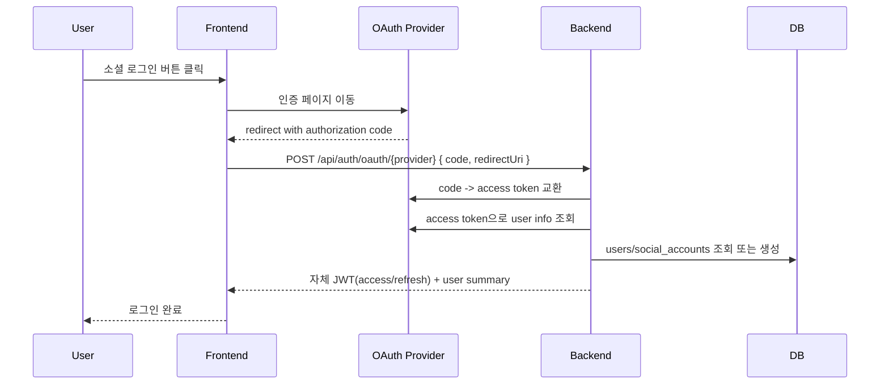

# BE-02 OAuth 구조 설계

## 전달 산출물

- OAuth 인증 흐름 다이어그램
- 라이브러리 결정서

## 최종 결정 요약

1. OAuth 구현은 기존 Spring Security + 커스텀 `OAuthAuthService` 확장 방식으로 간다.
2. `spring-boot-starter-oauth2-client`의 `oauth2Login` 기본 리다이렉트/세션 흐름으로 갈아타지 않는다.
3. 2주차 구현 전 네이버 OAuth를 같은 패턴으로 추가한다.
4. 소셜 로그인 사용자의 프로필 보완 흐름은 유지하되, 현재 코드 기준 `profile_completed` 계산 로직 변경이 선행되어야 한다.

## 현재 기준 정리

- 이미 구현됨: 카카오, 구글
- 이번 설계에서 새로 확정할 대상: 네이버
- 현재 인증 구조: 프론트가 authorization code를 받은 뒤 백엔드에 전달, 백엔드는 provider token 교환 후 자체 JWT 발급

## 왜 이 구조로 가는지

1. 현재 백엔드가 이미 `OAuthAuthService` 기반 code exchange 구조를 사용 중이다.
2. 카카오/구글 구현을 재사용할 수 있어 네이버 추가 비용이 가장 낮다.
3. `oauth2Login`으로 갈아타면 세션/리다이렉트 중심 흐름이 들어와 현재 JWT API 구조와 충돌한다.
4. 2주차 일정 기준으로는 “확장”이 맞고 “구조 전환”은 리스크가 크다.

## 팀장 확인 필요 항목

1. 네이버를 2주차 필수 범위로 확정하는지
2. 소셜 로그인 후 추가 프로필 입력 화면으로 보내는 흐름이 맞는지
3. `GET /api/auth/providers` 보조 API를 같이 둘지
4. 소셜 이메일 미제공 시 pseudo email 정책을 유지할지

## 팀장 확인 후 바로 구현할 항목

1. `AuthProvider.NAVER` 추가
2. `OAuthProperties.naver` 추가
3. `POST /api/auth/oauth/naver` 추가
4. 네이버 token exchange / user info adapter 추가
5. 프론트 네이버 콜백 페이지 추가
6. 운영 Redirect URI 등록

## 목적

네이버, 카카오, 구글 소셜 로그인을 2주차 구현 전에 확정한다.

현재 백엔드는 카카오/구글 OAuth 코드를 직접 교환한 뒤 자체 JWT를 발급하는 구조다. 이번 설계의 목표는 그 흐름을 유지하면서 네이버를 같은 패턴으로 추가하는 것이다.

## 현재 상태

- 구현 완료: 카카오, 구글
- 미구현: 네이버
- 현재 진입 API:
  - `POST /api/auth/oauth/kakao`
  - `POST /api/auth/oauth/google`
- 현재 요청 형식:

```json
{
  "code": "oauth-authorization-code",
  "redirectUri": "https://front.example.com/auth/callback"
}
```

## 라이브러리 결정

### 비교

#### 안 1. `spring-boot-starter-oauth2-client` 기반 `oauth2Login`

장점:

- 표준 OAuth2 클라이언트 구성 지원
- Provider 설정 자동화에 유리

단점:

- 현재 구조는 프론트가 code를 받은 뒤 백엔드에 전달하고, 백엔드는 자체 JWT를 발급한다.
- `oauth2Login` 기본 세션/리다이렉트 중심 흐름과 현재 JWT API 구조가 잘 맞지 않는다.
- 기존 카카오/구글 구현을 대폭 바꿔야 한다.

#### 안 2. 현재 방식 유지

구성:

- Spring Security는 JWT 보호와 인증 필터에만 사용
- Provider별 OAuth code exchange와 user info 조회는 `OAuthAuthService`에서 직접 처리

장점:

- 현재 카카오/구글 구조와 일관됨
- 프론트 콜백 페이지 구현이 단순함
- 자체 JWT 발급과 `social_accounts` 연결 로직을 그대로 재사용 가능
- 네이버 추가 비용이 가장 낮음

단점:

- Provider별 엔드포인트와 DTO를 직접 관리해야 함

### 최종 결정

`안 2`를 채택한다.

- 보안 프레임워크: 기존 Spring Security 유지
- OAuth provider 연동: 커스텀 `OAuthAuthService` 확장
- 이유: 현재 아키텍처와 가장 잘 맞고, 2주차 내 구현 리스크가 가장 낮다.

## Provider별 흐름

### 공통 흐름



### 카카오

- Token URL: `https://kauth.kakao.com/oauth/token`
- User Info URL: `https://kapi.kakao.com/v2/user/me`
- 현 구현 유지

### 구글

- Token URL: `https://oauth2.googleapis.com/token`
- User Info URL: `https://openidconnect.googleapis.com/v1/userinfo`
- 현 구현 유지

### 네이버

- Token URL: `https://nid.naver.com/oauth2.0/token`
- User Info URL: `https://openapi.naver.com/v1/nid/me`
- 2주차 구현 시 `OAuthAuthService`에 provider adapter 추가

## 계정 연결 정책

1. `social_accounts(provider, provider_user_id)` 기준으로 기존 계정 우선 조회
2. 없으면 이메일 기반 기존 `users` 연결 시도
3. 그래도 없으면 새 유저 생성
4. 유저 생성 시:
   - `auth_provider`는 최초 로그인 공급자
   - `email_verified = true`
   - 추가 프로필 입력 화면을 쓰려면 `profile_completed` 계산 로직을 별도 변경해야 함
5. 소셜에서 이메일을 못 주는 경우 fallback pseudo email 사용

## 프로필 완성 정책

고도화 이후 소셜 로그인 사용자는 아래 값이 비어 있을 수 있다.

- `full_name`
- `birth_date`
- `gender`
- `region`
- `signup_purpose`
- `side_hustle_experience_status`

현재 엔티티 기준으로는 닉네임이 있으면 `profile_completed=true`가 된다.

따라서 로그인 직후 추가 정보 입력 화면으로 보내려면 아래 중 하나를 구현해야 한다.

1. 소셜 가입 시 `profile_completed=false`를 명시적으로 저장
2. `full_name`, `birth_date`, `gender`, `region`, `signup_purpose`, `side_hustle_experience_status` 기준으로 완료 여부 재정의

즉, 이 흐름은 “정책 확정”만으로 끝나지 않고 2주차 서비스 로직 변경 항목이다.

## 권장 API

현재:

- `POST /api/auth/oauth/kakao`
- `POST /api/auth/oauth/google`

추가:

- `POST /api/auth/oauth/naver`

추가 권장:

- `GET /api/auth/providers`
  - 현재 환경에서 활성화된 provider 목록 반환

예시:

```json
{
  "providers": ["KAKAO", "GOOGLE", "NAVER"]
}
```

## 최종 구현 범위 요약

### 유지

- 카카오 OAuth
- 구글 OAuth
- 자체 JWT 발급
- `social_accounts` 기반 계정 연결

### 추가

- 네이버 OAuth
- 필요 시 `/api/auth/providers`
- 소셜 가입 후 프로필 보완 흐름

## 환경 변수

필수:

- `APP_AUTH_NAVER_ENABLED`
- `APP_OAUTH_NAVER_CLIENT_ID`
- `APP_OAUTH_NAVER_CLIENT_SECRET`
- `APP_OAUTH_NAVER_REDIRECT_URI`

기존 정리:

- `APP_AUTH_KAKAO_ENABLED`
- `APP_AUTH_GOOGLE_ENABLED`
- `APP_OAUTH_KAKAO_CLIENT_ID`
- `APP_OAUTH_KAKAO_CLIENT_SECRET`
- `APP_OAUTH_KAKAO_REDIRECT_URI`
- `APP_OAUTH_GOOGLE_CLIENT_ID`
- `APP_OAUTH_GOOGLE_CLIENT_SECRET`
- `APP_OAUTH_GOOGLE_REDIRECT_URI`

## 2주차 구현 체크포인트

1. `AuthProvider` enum에 `NAVER` 추가
2. `OAuthProperties`에 naver 추가
3. `OAuthAuthService`에 naver token exchange와 user info 조회 추가
4. `AuthController`에 `/oauth/naver` 추가
5. 프론트 콜백 페이지 추가
6. 운영 Redirect URI를 provider 콘솔에 등록

## 작업 완료 현황

- [x] 네이버 OAuth 2.0 흐름 설계
- [x] 카카오 OAuth 2.0 흐름 설계
- [x] 구글 OAuth 2.0 흐름 설계
- [x] Spring Security 라이브러리 선택 (비교 후 확정)
- [x] 통합 인증 흐름 다이어그램 작성
- [x] API 연동 준비

## 전달 메모

- 현재 백엔드 코드와 가장 충돌이 적은 방향은 `OAuthAuthService` 확장이다.
- 구조를 `oauth2Login`으로 갈아타면 2주차 일정 리스크가 커진다.
- 이 문서는 “새 프레임워크 도입”보다 “현재 구조 확장”을 기준으로 작성했다.
- 소셜 로그인 후 프로필 보완 흐름을 쓰려면 `profile_completed` 계산 로직 변경이 함께 필요하다.
