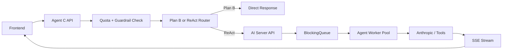

# BE-05 큐잉 인프라 설계 문서

## 목적

에이전트 C의 ReAct 요청이 동시에 몰릴 때 Anthropic rate limit과 백엔드 자원 고갈을 막기 위해 단순한 큐잉 구조를 설계한다.

이번 프로젝트에서는 외부 메시지 브로커 대신 Spring 애플리케이션 내부 큐를 우선 사용한다.

## 전제

- 목표 동시 처리 사용자 수: 10명
- 응답 방식: 단일턴 + SSE 스트리밍
- 긴 요청은 에이전트 C ReAct 경로에서만 주로 발생
- 단순 질문은 Plan B로 우회해 큐 부담을 줄인다.
- 실제 LLM 호출과 LangSmith trace 기록은 `ai-server`가 담당한다고 가정한다.
- `server`는 인증, 입력 검증, quota, 라우팅, 저장, 프론트 응답 중계를 담당한다.

## 왜 BlockingQueue인가

장점:

- 학생 프로젝트 규모에 맞게 단순하다.
- Redis/RabbitMQ 없이도 구현 가능하다.
- 토큰 정책과 함께 묶어 제어하기 쉽다.

제약:

- 다중 인스턴스 환경 확장성은 낮다.
- 프로세스 재시작 시 메모리 큐는 비워진다.

현재 범위에서는 허용 가능하다.

## 제안 구조

## 컴포넌트

### 책임 분리

- `server`
  - 인증 확인
  - 입력 길이/금칙어/카테고리 검증
  - quota 확인
  - Plan B / ReAct 라우팅
  - `ai-server` 호출
  - 최종 결과 저장 및 FE 응답 중계
- `ai-server`
  - ReAct queue 운영
  - tool 호출
  - Plan B fallback 수행
  - LangSmith tracing 기록
  - 최종 answer / citations / usage 반환

### 1. `AgentTaskQueue`

- 자료구조: `LinkedBlockingQueue<AgentTask>`
- 역할: ReAct 요청 대기열

권장 설정:

- 최대 길이: `100`

### 2. `AgentTaskWorker`

- 고정 worker 수: `10`
- 역할:
  - 큐에서 작업 poll
  - 토큰 정책 재확인
  - tool 호출
  - 결과 저장
  - SSE 채널에 전송

### 3. `AgentTask`

필드 예시:

- `taskId`
- `userId`
- `question`
- `categoryHint`
- `submittedAt`
- `routeType`
- `sseEmitterId`

## 요청 처리 흐름

1. 입력 길이, banned words, 카테고리 whitelist 검증
2. 사용자 quota 확인
3. 질문 라우팅
4. Plan B면 `server`에서 즉시 처리 또는 `ai-server` Plan B endpoint 호출
5. ReAct면 `ai-server` 내부 큐 적재
6. `ai-server` worker가 순차 처리
7. 응답 완료 후 `server`가 사용량 저장

### 라우팅 확정 규칙

1. 질문 길이 `< 30자`면 무조건 Plan B
2. 길이 조건을 넘고, ReAct 키워드가 하나라도 있으면 ReAct
3. 그 외는 Plan B

ReAct 키워드:

- `비교`
- `통계`
- `유사`
- `성공사례`
- `실패사례`
- `차이`
- `분석`
- `추천`

메모:

- 길이 `< 30자` 규칙이 키워드보다 우선한다.
- 따라서 짧은 질문은 키워드가 있어도 Plan B로 보낸다.

## 대기 UX

### 기본 문구

- "질문을 확인하고 있어요."
- "잠시만 기다려주세요. 순서대로 답변 중이에요."
- "앞에 처리 중인 요청이 있어 조금만 기다려주세요."

### 프론트 상태

- `QUEUED`
- `PROCESSING`
- `STREAMING`
- `DONE`
- `FAILED`

## 타임아웃 정책

### 큐 대기 타임아웃

- 최대 `30초`
- 30초 초과 시:
  - ReAct 요청 취소
  - Plan B로 자동 전환 또는 실패 응답

권장 기본:

- 가능하면 Plan B 자동 전환

### 작업 실행 타임아웃

- 전체 실행 `30초`
- Tool 호출 재시도 1회
- 초과 시 `fallback_reason=timeout`

## 우선순위 전략

현재 범위에서는 단일 FIFO를 권장한다.

추가 최적화가 필요하면 아래 정도만 고려한다.

1. 관리자/시연 계정 우선순위
2. Plan B 우선 direct path

## 실패 처리

### 큐가 가득 찼을 때

- HTTP `429` 또는 `503`
- 메시지:
  - "현재 상담 요청이 많아요. 잠시 후 다시 시도해주세요."

### Worker 실패

- 작업 상태를 `FAILED`로 기록
- fallback 가능 시 Plan B 실행

### 서버 재시작

- 메모리 큐는 비워진다.
- 사용자에게는 재시도 유도 문구 필요

## 운영 지표

- 현재 큐 길이
- 평균 대기 시간
- 최대 대기 시간
- 처리 성공률
- timeout 비율
- fallback 비율

## 구현 권장 클래스

- `AgentTask`
- `AgentTaskQueue`
- `AgentQueueService`
- `AgentWorker`
- `AgentSseService`
- `AgentRoutingService`

## 전달 메모

- 큐는 `server` 내부보다 실제 LLM 호출 주체인 `ai-server` 내부에 두는 쪽이 책임 경계가 명확하다.
- `server`는 빠른 차단과 라우팅만 담당하고, 비용이 큰 ReAct 실행 경로는 `ai-server`로 넘기는 구조를 권장한다.

## 구현 권장 순서

1. 라우팅 서비스 분리
2. 내부 queue bean 구성
3. worker pool 구성
4. SSE emitter 관리 추가
5. timeout/fallback 연동
6. 모니터링 지표 노출

## 작업 완료 현황

- [x] Spring BlockingQueue 기반 큐 구조 설계
- [x] 동시 처리 가능 사용자 수 정의 (목표: 10명)
- [x] 큐 대기 시 사용자 안내 UX 흐름
- [x] 큐 타임아웃 정책
- [x] 4주차 구현 시 참고할 설계 문서
