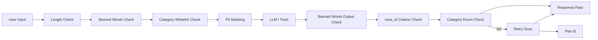

# BE-06 가드레일 인프라 설계 문서

## 목적

에이전트 C와 향후 AI 응답 기능에 대해 입력/출력/도메인 범위/개인정보 보호를 한 번에 막는 가드레일 구조를 정리한다.

## 보호 범위

1. 부적절한 입력
2. 부적절한 출력
3. 허용되지 않은 카테고리
4. PII 노출
5. 허구의 case_id 인용
6. 허용되지 않은 정책 문서/안내 라벨 인용

## 입력 가드레일

### 1. 입력 길이 제한

- 최대 `500자`
- FE와 BE에서 모두 검증
- 초과 시 메시지:
  - "질문을 500자 이내로 줄여주세요."

### 2. `BANNED_WORDS` 필터링

소스:

- `ai/banned_words.md`

적용 대상:

- 에이전트 C 질문
- 향후 자유 입력형 AI 요청

처리:

1. 정규화
   - trim
   - 다중 공백 축소
   - 소문자화 가능한 영문 소문자화
2. 금칙어 매칭
3. 차단 응답

차단 메시지:

- "부적절한 표현이 포함되어 있어요. 표현을 조금 바꿔서 다시 입력해주세요."

### 3. 카테고리 화이트리스트

허용 값:

- `commerce`
- `content`
- `digital`
- `platform`
- `freelance`
- `investment`
- `offline`

처리:

- 요청의 `categoryHint`가 있으면 enum 검증
- 경험/가이드 연계 시 category slug 기준으로 매핑
- 화이트리스트 외 값이면 차단 또는 일반 가이드 fallback

공용 enum 소스:

- AI-05 명세의 `ALLOWED_CATEGORIES`
- 서비스 정책 문서의 7개 카테고리 정의

slug ↔ 한글 매핑 기준:

| slug | 한글 카테고리 |
| --- | --- |
| `commerce` | `온라인 판매·이커머스` |
| `content` | `콘텐츠·SNS` |
| `digital` | `디지털·지식판매` |
| `platform` | `플랫폼 노동` |
| `freelance` | `재능·프리랜서` |
| `investment` | `투자·재테크` |
| `offline` | `오프라인 부업` |

구현 권장:

- `CategoryMapper` util 분리
- 입력/DB/filter는 slug 기준
- LLM 응답 검증/정규식/정책 문서 표시는 한글 기준
- 검증 전후 변환은 `CategoryMapper.toSlug()`, `CategoryMapper.toDisplayName()`으로 통일

## 출력 가드레일

### 1. `BANNED_WORDS` 후처리

적용 대상:

- LLM 최종 응답 text

처리:

1. 응답 검사
2. 금칙어 미검출 시 통과
3. 검출 시 재생성 1회
4. 재생성도 실패 시 Plan B

### 2. `case_id` 인용 검증

검증 목적:

- 환각 방지
- 실제 검색 결과 없는 출처 생성 방지

처리:

1. tool 실행 결과에서 허용 `case_id` 집합 생성
2. LLM 응답에서 인용된 `case_id` 추출
3. Plan B 트리거 `tool_empty_result`면 인용 검증 예외로 통과
4. 그 외에는 모두 허용 집합 안에 있는지 확인
5. 누락 또는 허구 인용이면 재생성 1회
6. 재생성 실패 시 Plan B

예외 규칙:

- `fallback_reason=tool_empty_result`인 응답은 일반 가이드 템플릿 응답이므로 `case_id` 인용을 요구하지 않는다.
- 이 경우 로그에 `case_id_validation_skipped=true`를 남긴다.

### 3. 출처 / 안내 라벨 형식 검증

허용 출처 enum:

- `case_{number}`
- `업종 통계 — {ALLOWED_CATEGORIES}`
- `사이드픽 서비스 정책`
- `사이드픽 안전 정책`

허용 안내 라벨 enum:

- `[안내: 사례 0건]`
- `[안내: 추가 정보 필요]`
- `[안내: 가이드 페이지 안내]`

처리:

1. 응답에 `[안내: ...]`가 있으면 허용 라벨인지 확인
2. 응답에 `[출처: ...]`가 있으면 허용 enum 조합인지 확인
3. 혼합 형식은 허용
4. 형식 불일치 시 재생성 1회
5. 재생성 실패 시 Plan B

### 4. 카테고리 응답 검증

검증 대상:

- 응답 payload 안의 `category`
- 내부 reasoning 결과의 라우팅 category

처리:

- enum 검증 실패 시 재생성
- 반복 실패 시 fallback

### 5. 수치 검증

검증 대상:

- `%`
- `건`
- `명`
- 기타 Tool 결과 기반 수치 표현

처리:

1. 응답에서 수치 문자열 추출
2. `search_cases`, `query_stats` 결과에서 수치 집합 추출
3. 응답 수치가 Tool 결과 집합의 부분집합인지 확인
4. 불일치 시 환각으로 판단
5. 재생성 1회 후 실패 시 Plan B

예외:

- 정책 문서 인용 응답
- `[안내: 사례 0건]`
- `[안내: 추가 정보 필요]`
- `[안내: 가이드 페이지 안내]`

### 6. case_id 존재 검증

처리:

1. 응답에서 `case_id` 목록 추출
2. 추출된 ID가 실제 DB 또는 검색 결과 집합에 존재하는지 확인
3. 존재하지 않는 ID가 있으면 재생성 1회
4. 재생성 실패 시 Plan B

## PII 마스킹

### 저장 전 마스킹 대상

- 전화번호
- 이메일
- 주민등록번호 패턴

### 로그 마스킹 대상

- 사용자 질문 원문
- 에러 로그
- LangSmith metadata

### 예시 정규식

- 전화번호: `01[0-9]-?[0-9]{3,4}-?[0-9]{4}`
- 이메일: `[A-Za-z0-9._%+-]+@[A-Za-z0-9.-]+\\.[A-Za-z]{2,}`
- 주민번호: `[0-9]{6}-?[1-4][0-9]{6}`

### 마스킹 예시

- `010-1234-5678` -> `010-****-5678`
- `user@example.com` -> `u***@example.com`

## 처리 순서

## 구현 권장 계층

### 요청 전

- `InputGuardService`
- `CategoryWhitelistValidator`
- `CategoryMapper`
- `PiiMaskingService`

### 응답 후

- `OutputGuardService`
- `CaseCitationValidator`
- `BannedWordValidator`
- `CitationFormatValidator`
- `NumericEvidenceValidator`
- `CaseExistenceValidator`

### 공통 설정

- `BANNED_WORDS_FILE`
- `AI_ALLOWED_CATEGORIES`
- `ALLOWED_POLICY_DOCS`
- `SPECIAL_LABELS`
- `CASE_ID_CITATION_REQUIRED`
- `PII_MASKING_ENABLED`

## 오류 처리 원칙

### 입력 차단

- 사용자에게 명시적으로 안내
- HTTP `400`

### 출력 차단

- 사용자에게 내부 검증 사실을 과하게 노출하지 않음
- 서버에서 재생성 또는 Plan B

## 4주차 구현 포인트

1. 금칙어 로딩은 메모리 캐시
2. 정규식 마스킹은 공용 util/service 분리
3. 정책 문서 출처 enum은 `사이드픽 서비스 정책`, `사이드픽 안전 정책` 2개로 고정
4. 수치 검증은 Tool 결과 없는 응답에 강제하지 않는다
5. case_id 검증은 tool layer와 response layer 사이에 배치
6. 가드레일 결과는 로그에 `guardrail_reason` 또는 `validation_failure:{reason}`으로 남긴다

## 작업 완료 현황

- [x] BANNED_WORDS 필터링 입력 처리 구조
- [x] BANNED_WORDS 필터링 출력 처리 구조
- [x] 카테고리 화이트리스트 enum 검증 로직
- [x] PII 마스킹 정규식
- [x] case_id 인용 검증 로직
- [x] 정책 문서 / 안내 라벨 출처 검증 로직
- [x] 수치 검증 로직
- [x] case_id 존재 검증 로직
- [x] 차단 시 재생성 로직 (max 1회) 설계
