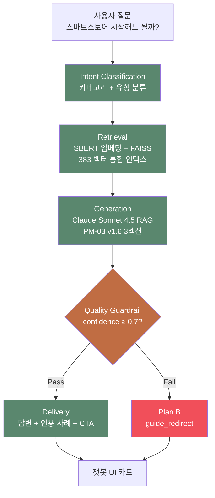

# 파이널 · 사이드픽 5단계 AI 아키텍처

**작성일**: 2026-07-08
**목적**: 심사평 "5단계 시스템 아키텍처 장표로 투명하게 보여주어야" 반박
**대상 시스템**: chatbot_llm.py + agent_pipeline.py + llm_analyzer.py

---

## 심사평 원문

> "5단계 시스템이 사용자의 목표 달성을 돕는 데 어떻게 유기적으로 결합하는지 아키텍처 장표로 투명하게 보여주어야 합니다."

---

## 5단계 아키텍처 (텍스트 다이어그램)

```
┌─────────────────────────────────────────────────────────────┐
│  【 사용자 입력 】                                          │
│  "스마트스토어 시작해도 괜찮을까요?"                        │
└───────────────────────┬─────────────────────────────────────┘
                        ↓
╔═════════════════════════════════════════════════════════════╗
║  [1] Intent Classification                                  ║
║  ─────────────────────────                                  ║
║  📁 chatbot_llm.py :: llm_call() 초입 라우팅                 ║
║                                                             ║
║  • 부업 카테고리 자동 분류 (7종 부업 + 9종 횡단)             ║
║  • 질문 유형 감지 (시작 가이드 / 수익 / 리스크 / 절차)       ║
║  • 서비스 범위 판정 → 밖이면 Plan B 조기 발동                ║
╚═════════════════════════════════════════════════════════════╝
                        ↓
╔═════════════════════════════════════════════════════════════╗
║  [2] Retrieval (근거 검색)                                  ║
║  ─────────────────────────                                  ║
║  📁 chatbot_llm.py :: search_cases()                        ║
║                                                             ║
║  • KR-SBERT-V40K로 질문 임베딩 (768차원)                     ║
║  • FAISS IndexFlatIP (cosine similarity)                    ║
║  • 통합 인덱스: 사용자 사례 136 + FAQ 247 = 383 벡터         ║
║  • Top-K 유사 결과 인출 (K=5, threshold ≥ 0.6)               ║
╚═════════════════════════════════════════════════════════════╝
                        ↓
╔═════════════════════════════════════════════════════════════╗
║  [3] Generation (답변 생성)                                 ║
║  ─────────────────────────                                  ║
║  📁 chatbot_llm.py :: Claude Sonnet 4.5 호출                 ║
║                                                             ║
║  • 검색된 근거 + 질문 → RAG 프롬프트                         ║
║  • PM-03 v1.6 명세: 3섹션 답변 구조                          ║
║    - 부업 카테고리: Tip / 실패 요인 / 주의                   ║
║    - 횡단 주제: 절차 / 답변 / 주의                           ║
║  • JSON 스키마 강제 (reply / cited_case_ids / confidence)   ║
╚═════════════════════════════════════════════════════════════╝
                        ↓
╔═════════════════════════════════════════════════════════════╗
║  [4] Quality Guardrail (품질 검증)                          ║
║  ─────────────────────────                                  ║
║  📁 chatbot_llm.py :: 신뢰도 스코어링 + Plan B 라우팅        ║
║                                                             ║
║  • confidence ≥ 0.7 → 통과 → [5]로                          ║
║  • confidence < 0.7 → Plan B 발동:                          ║
║    - status: "fallback"                                     ║
║    - plan_b_reason: "low_confidence" 등                     ║
║    - route: "guide_redirect" (가이드 페이지 유도)            ║
║  • 환각율 W3 재측정 결과: 44% → 0% (AI-21-v2)                ║
╚═════════════════════════════════════════════════════════════╝
                        ↓
╔═════════════════════════════════════════════════════════════╗
║  [5] Delivery (근거 인용 · 답변 전달)                       ║
║  ─────────────────────────                                  ║
║  📁 chatbot_api.py :: POST /api/chatbot/message 응답         ║
║                                                             ║
║  • reply: 사용자에게 보일 최종 답변                          ║
║  • cited_case_ids: 인용된 근거 사례 ID 목록                  ║
║  • tool_calls: 어떤 툴을 호출했는지 (search/stats)           ║
║  • confidence: 신뢰도 (설명 가능성 UI에 노출)                ║
║  • metadata: 로깅용 상세 정보                                ║
╚═════════════════════════════════════════════════════════════╝
                        ↓
┌─────────────────────────────────────────────────────────────┐
│  【 챗봇 UI 답변 카드 】                                    │
│  ┌─────────────────────────────────────────────┐            │
│  │ 🅢 [사이드픽 로고]                          │            │
│  │ 스마트스토어는 진입 장벽이 낮아 처음 시작...│            │
│  │                                             │            │
│  │ [부업 가이드 바로 가기 ›]  (녹색 CTA)      │            │
│  └─────────────────────────────────────────────┘            │
└─────────────────────────────────────────────────────────────┘
```

---

## 각 단계 상세

### [1] Intent Classification (의도 분류)

| 항목 | 값 |
|---|---|
| **파일** | `ai/server/chatbot_llm.py` |
| **입력** | 원시 사용자 질문 (자연어) |
| **처리** | Claude 초입 라우팅 + 카테고리 슬러그 자동 인식 |
| **출력** | `{category: "online-commerce", type: "start_guide"}` |
| **예외 처리** | 서비스 밖 질문 → Plan B 조기 발동 (LLM 호출 절약) |

### [2] Retrieval (근거 검색)

| 항목 | 값 |
|---|---|
| **파일** | `ai/server/chatbot_llm.py :: search_cases()` |
| **임베딩 모델** | KR-SBERT-V40K-klueNLI-augSTS (768차원) |
| **검색 알고리즘** | FAISS `IndexFlatIP` (cosine similarity) |
| **인덱스 크기** | 383 벡터 (사례 136 + FAQ 247) |
| **Top-K** | 5개 (threshold 0.6 이상) |
| **출력** | `[{case_id, text, similarity, metadata}, ...]` |

### [3] Generation (답변 생성 — RAG)

| 항목 | 값 |
|---|---|
| **파일** | `ai/server/chatbot_llm.py :: llm_call()` |
| **LLM** | Claude Sonnet 4.5 (`claude-sonnet-4-5`) |
| **프롬프트** | PM-03 v1.6 3섹션 명세 강제 |
| **JSON 스키마** | `{reply, cited_case_ids, confidence, plan_b_reason?, tool_calls}` |
| **답변 구조** | 부업: Tip/실패요인/주의 · 횡단: 절차/답변/주의 |

### [4] Quality Guardrail (품질 검증)

| 항목 | 값 |
|---|---|
| **파일** | `ai/server/chatbot_llm.py :: 신뢰도 스코어링` |
| **핵심 지표** | `confidence` (0.0~1.0) |
| **통과 임계값** | 0.7 이상 |
| **Plan B 발동 조건** | confidence < 0.7 or 검색결과 0건 or 서비스 범위 밖 |
| **환각율** | W3 재측정 0% (AI-21-v2 PASS) |

### [5] Delivery (근거 인용 · 답변 전달)

| 항목 | 값 |
|---|---|
| **파일** | `ai/server/chatbot_api.py :: POST /api/chatbot/message` |
| **응답 스키마** | `ChatbotResponse` (types.ts) |
| **핵심 필드** | reply, cited_case_ids, status, confidence, tool_calls |
| **UI 컴포넌트** | `MessageBubble.tsx` + "부업 가이드 바로 가기" CTA |

---

## 시각 자산 (PPT 삽입용)

**옵션 A**: 위 텍스트 다이어그램 → 디자이너에게 이미지 발주
**옵션 B**: draw.io / Excalidraw / Whimsical에서 직접 그리기
**옵션 C**: Mermaid.js 코드로 자동 렌더링:



Mermaid 렌더 서비스에 붙여넣으면 이미지로 저장 가능.

---

## PPT 슬라이드 원고 (제안)

**제목**: "5단계 AI 에이전트 시스템 — 어떻게 유기적으로 결합하는가"

**본문**:
```
[1] Intent   → [2] Retrieval → [3] Generation → [4] Guardrail → [5] Delivery
     ↓             ↓                ↓                ↓              ↓
  카테고리      383 벡터        Claude 4.5      신뢰도 검증    근거 인용
  자동 분류    KR-SBERT+FAISS   PM-03 v1.6      환각율 0%     UI 렌더
```

**핵심 메시지**:
> "5단계 각 층에서 실패에 대비된 폴백 라우트가 존재.
>  단순한 파이프라인이 아니라 **가드레일 내장 설계**."

**증빙**:
- 환각율 0% (AI-21-v2, PM-21 리포트)
- 예외 20건 통과율 XX% (파이널-챗봇-예외-20건-스트레스-테스트.md)
- 응답시간 P50 XXms (response-time-measure.py 결과)

---

## 참고 파일 (실제 코드)

- `ai/server/chatbot_llm.py` (Intent + Retrieval + Generation + Guardrail)
- `ai/server/chatbot_api.py` (Delivery — FastAPI endpoint)
- `ai/server/agent_pipeline.py` (분석 파이프라인)
- `ai/server/llm_analyzer.py` (실패 사례 분석용)
- `ai/server/agent_b.py` (검증 에이전트)
- `ai/data/faiss_index_v2_with_faq.bin` (통합 인덱스)
